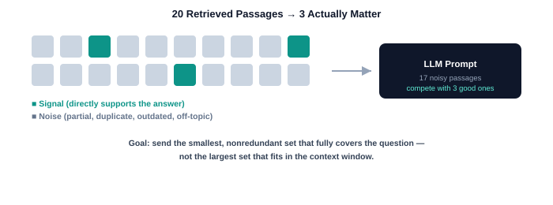
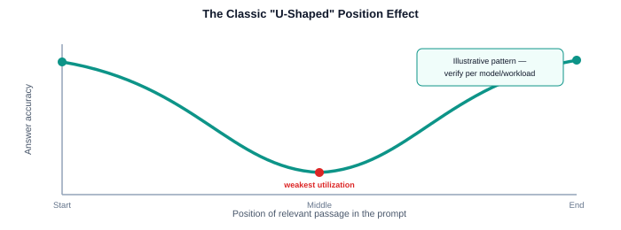
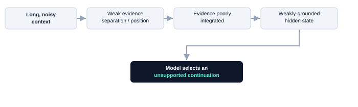
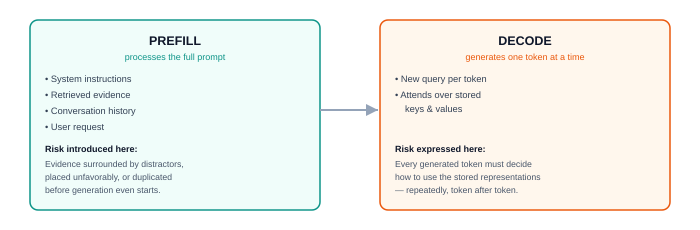
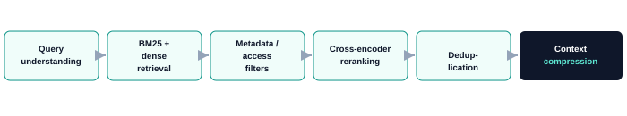
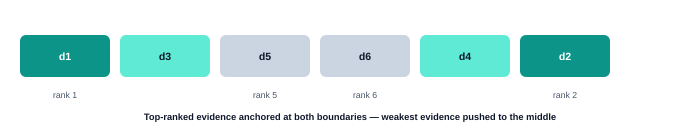

Modern LLMs can accept enormous prompts — 128K, 200K, even a million tokens. That capability has quietly reshaped how many teams build retrieval-augmented systems: retrieve broadly, stuff everything into the prompt, and trust the model to sort it out. It's a tempting shortcut. It's also the wrong mental model.

A model's ability to *accept* a long prompt is not the same as its ability to *use* every part of that prompt reliably. This gap has a name in the research literature: **"lost in the middle."** Relevant information placed near the start or end of a long prompt tends to get used more reliably than equally relevant information buried in the middle.

> **A larger context window increases capacity. It does not guarantee better evidence utilization.**

This article walks through why that happens, where it happens in the inference stack, which popular infrastructure techniques actually fix it (spoiler: almost none of them), and what a production-grade retrieval pipeline looks like when it's built to avoid the problem instead of hoping the model works around it.

## Table of Contents

1. [The signal-to-noise problem](#01-the-signal-to-noise-problem)
2. [Is it just softmax?](#02-is-it-simply-a-softmax-problem)
3. [Attention vs. next-token probability](#03-attention-weights-are-not-the-same-as-output-probabilities)
4. [How one bad token snowballs](#04-how-one-wrong-token-snowballs)
5. [Prefill vs. decode](#05-prefill-vs-decode-where-does-this-actually-happen)
6. [The KV cache myth](#06-is-the-kv-cache-diluted-no--and-that-distinction-matters)
7. [What infra tricks really solve](#07-what-your-infra-stack-actually-solves)
8. [Retrieval as quality control](#08-retrieval-is-the-first-quality-control-layer)
9. [Query decomposition](#09-query-decomposition)
10. [Context compression](#10-context-compression--without-losing-meaning)
11. [U-shaped evidence ordering](#11-u-shaped-context-ordering)
12. [Guided decoding's limits](#12-guided-decoding-doesnt-guarantee-truth)
13. [Grounding & validation](#13-grounding-and-validation)
14. [The full production pipeline](#14-the-full-production-workflow)
15. [Metrics that matter](#15-measure-quality-and-infrastructure-separately)
16. [Testing position sensitivity](#16-test-position-sensitivity-directly)

---

## 01. The Signal-to-Noise Problem

Say a retrieval system pulls 20 passages for a single user question. In practice, maybe three of them actually support the answer. The other seventeen are typically some mix of partially relevant, duplicated, outdated, tied to the wrong time period, about a similarly named entity, semantically close but factually different, or relevant to a different part of the question.

Every one of those passages competes for the model's attention. If the three good passages are the *signal* and the other seventeen are *noise*, then adding more retrieved documents can actually make the signal-to-noise ratio worse, not better. That's why teams frequently see retrieval recall go up while answer quality goes down as they widen the retrieval window.


*Goal: send the smallest, nonredundant set that fully covers the question — not the largest set that fits in the context window.*

## 02. Is It Simply a Softmax Problem?

Attention softmax is a useful lens, but it doesn't tell the whole story. For each query token, an attention head distributes weight across all earlier tokens, and as the context grows, more terms get added to that distribution's denominator.

But softmax doesn't automatically flatten just because the sequence is long. If a relevant token's score is meaningfully higher than the distractors around it, attention can stay sharply focused even in a very long prompt. The failure mode shows up specifically when the score gap between relevant and irrelevant content isn't large enough to outweigh the combined pull of many distractors.

> **In practical terms:** The longer and noisier the prompt, the more decisively the model needs to separate useful evidence from everything else. When that separation is weak — and especially when the relevant evidence sits in the middle of the sequence — it can receive insufficient effective attention even though it's fully present in the prompt.



## 03. Attention Weights Are Not the Same as Output Probabilities

It's important not to conflate attention softmax with the model's final vocabulary softmax. Attention softmax decides which earlier token representations should influence the current hidden state. Vocabulary softmax decides which token gets generated next. Between those two steps, information passes through many transformer layers, attention heads, residual connections, and feed-forward networks.

So diffuse attention doesn't directly mean several similar candidate tokens will end up with equal output probability. A more accurate failure chain looks like this:



## 04. How One Wrong Token Snowballs

LLMs generate one token at a time, and each generated token becomes part of the context for generating the next one. If the model commits early to an incorrect date, company, person, or interpretation, later tokens can remain fluently consistent with that wrong premise.

> **Example**
>
> **Incorrect initial statement:** "The policy was introduced in 2022."
>
> **Later continuation:** "After its 2022 introduction, adoption increased the following year."

The second sentence is fluent and internally consistent — and still wrong, because the original premise was never supported by the evidence. This is best described as **autoregressive error propagation**, or commitment amplification. It doesn't mean one wrong token always causes a hallucination — models can and do recover — but unsupported early commitments can shape everything generated after them.

## 05. Prefill vs. Decode: Where Does This Actually Happen?

LLM inference runs in two phases, and lost-in-the-middle behavior touches both.



> The long prompt creates the evidence-selection challenge during prefill; the consequences are repeatedly expressed during decoding.

## 06. Is the KV Cache "Diluted"? No — and That Distinction Matters

The KV cache stores the key and value tensors computed for previous prompt and output tokens, purely to avoid recomputing them at every decoding step. The attention distribution itself is recalculated for every newly generated token — it is not some fixed distribution frozen inside the cache.

> ⚠️ **Common misconception:** "The KV cache gets diluted with too much context." More precisely: the cache stores representations of whatever context you supplied. If that context is noisy, poorly ordered, or weakly represented, decoding may fail to use those cached representations well — but the cache is preserving the model's computation faithfully, not degrading it. **The cache doesn't correct the quality of the context; it just remembers it.**

## 07. What Your Infra Stack Actually Solves

This is the section worth pinning to your team's wiki. A lot of infrastructure investment gets justified in the name of "fixing long-context quality" when it's really solving cost, latency, or memory — not grounding.

| Technique | What it actually improves | Fixes lost-in-the-middle? |
|---|---|---|
| **KV caching** | Decode efficiency, latency, throughput, cost per token | ❌ No |
| **Prefix caching** | Reuses computed KV blocks for shared prompt prefixes → faster time-to-first-token | ❌ No |
| **PagedAttention** | GPU memory utilization, concurrency, cache sharing | ❌ No |
| **FlashAttention** | Faster, more memory-efficient attention computation | ❌ No |
| **YaRN / position scaling** | Lets the model technically process longer sequences | ❌ No — extends length, not utilization |
| **Guided decoding** | Structural validity (JSON, schema, enum compliance) | ❌ No — structure ≠ truth |
| **Retrieval & reranking** | What evidence reaches the model in the first place | ✅ Yes |
| **Compression & dedup** | Signal-to-noise ratio inside the prompt | ✅ Yes |
| **Evidence ordering** | Where the good evidence sits relative to prompt boundaries | ✅ Partially |
| **Grounding & validation** | Whether the final claim is actually supported | ✅ Yes |

None of the efficiency techniques are wasted work — they're essential for running production inference at acceptable cost and latency. The point is narrower: **they change how fast and how cheaply you get an answer, not whether that answer is well-grounded.** Confusing the two leads teams to "solve" lost-in-the-middle by upgrading infrastructure that was never going to touch it.

## 08. Retrieval Is the First Quality-Control Layer

The strongest mitigation happens before the prompt ever reaches the LLM. A mature retrieval pipeline typically looks like this:



**Hybrid retrieval.** Dense retrieval captures semantic similarity. BM25 captures exact terms — names, product IDs, dates, legal clauses, error codes, version numbers — that embeddings can blur together. Combining both improves coverage in ways neither achieves alone.

**Metadata filtering.** Filters on tenant, geography, time period, product version, document status, department, or source authority stop semantically similar but *invalid* evidence from ever reaching the model — before it can compete for attention.

**Cross-encoder reranking.** The first-stage retriever is optimized for speed across a huge candidate pool. A cross-encoder jointly evaluates the query and each candidate passage, and is far better at distinguishing subtle relevance differences that the first pass misses.

**Deduplication.** Overlapping chunks create redundant attention competition and burn tokens for no benefit. Removing duplicates improves both context quality and inference cost in one move.

## 09. Query Decomposition

Complex questions often bundle several distinct information needs. Consider:

> "Compare the company's revenue growth, AI investment, and regulatory risk over the last three years."

That decomposes cleanly into: what was the revenue growth, what AI investments were disclosed, what regulatory risks were reported, and how did each change over three years. Retrieving evidence separately per sub-question can improve coverage and cut down competition between unrelated concepts in a single prompt.

> ⚠️ Decomposition isn't free. It adds retrieval calls, latency, more opportunities to drop constraints, and more synthesis complexity. **Use direct retrieval for simple questions; reserve decomposition for multi-hop, temporal, or comparative questions.**

## 10. Context Compression — Without Losing Meaning

A retrieved chunk may bury one relevant sentence inside a long, mostly irrelevant passage. Compression techniques — query-focused sentence selection, structured fact extraction, parent-child retrieval, table-row extraction, contextual summaries — keep the useful evidence and cut the surrounding noise.

The catch: compression can silently change meaning if it drops qualifiers.

**Original:**
> "Revenue increased by 12%, **excluding the discontinued consumer division.**"

**Over-compressed (wrong):**
> "Revenue increased by 12%."

Production-grade compression has to preserve negation, dates, units, exceptions, uncertainty, source identifiers, and original document offsets — not just the shortest paraphrase that fits.

## 11. U-Shaped Context Ordering

Because models often use information near prompt boundaries more reliably, the highest-ranked evidence can be placed near the start and end of the evidence region, pushing lower-ranked passages toward the middle.

If a reranker outputs `d1, d2, d3, d4, d5, d6` in order of relevance, one U-shaped arrangement looks like:



A production prompt built around this idea might sequence as: compact system instructions → highest-ranked evidence → supporting evidence → lower-ranked evidence → second-highest-ranked evidence → user request → citation and abstention requirements.

> ⚠️ This is a heuristic, not a law of physics. Different models show different positional behavior — **test evidence placement experimentally on your own workload** rather than assuming the pattern transfers.

## 12. Guided Decoding Doesn't Guarantee Truth

Guided decoding forces the model to emit valid JSON, a required schema, an allowed enum, or regex-compatible output. That's genuinely useful — it eliminates a whole category of parsing and formatting failures. But a structurally perfect answer can still be factually wrong:

```json
{
  "company": "Apple",
  "revenue": "$999 billion",
  "source": "document_4"
}
```

That JSON is perfectly valid. The number and the citation may still be completely unsupported by the evidence. **Guided decoding is a structural reliability tool, not a factual verification tool** — treat it as solving a different problem than grounding.

## 13. Grounding and Validation

Production systems need controls that live outside prompt engineering entirely:

- Source identifiers attached to every chunk
- Claim-level citations
- Citation-existence checks
- Verification that a cited passage actually supports the claim
- Deterministic date and numeric checks
- Entity-consistency checks
- Contradiction detection
- Explicit abstention when evidence is insufficient

> "Answer only from the supplied evidence. Cite each material claim. If the evidence does not support an answer, state that the available information is insufficient." — then verify the model actually followed it.

## 14. The Full Production Workflow

Put together, a practical end-to-end pipeline looks like this:



## 15. Measure Quality and Infrastructure Separately

These two dimensions answer different questions, and a system can fail on either one independently — fast and wrong, or accurate but too expensive to run. Track both.

**Quality metrics**
- Recall@K
- NDCG / MRR
- Required-facet coverage
- Duplicate rate
- Claim-support rate
- Citation precision & completeness
- Contradiction rate
- Correct abstention rate

**Infrastructure metrics**
- Time to first token
- Inter-token latency
- Prompt token count
- Prefix-cache hit rate
- KV-cache occupancy & eviction
- GPU utilization
- Throughput
- Cost per request

## 16. Test Position Sensitivity Directly

Lost-in-the-middle behavior belongs in your evaluation suite, not just in a blog post. Place the same relevant passage at different positions — near the beginning, first quarter, middle, third quarter, near the end — while keeping the rest of the prompt unchanged, and measure answer accuracy, citation selection, claim support, abstention, latency, and token cost at each position.

Repeat across different prompt lengths, distractor counts, conflicting documents, multiple models, and evidence-ordering strategies. The output is a **workload-specific position-sensitivity curve** — far more actionable than leaning on general-purpose benchmarks that were never run against your data.

---

## Final Takeaway

Lost in the middle points at an important production reality: **context capacity is not context intelligence.** A long context window lets the model receive more information — it does not guarantee that every piece of that information will be used equally, or correctly.

Retrieval, reranking, compression, and evidence ordering improve what the model is given. KV caching, prefix caching, PagedAttention, and FlashAttention improve how efficiently it processes that input. YaRN and other positional-scaling methods extend how much it can technically accept. Guided decoding improves output structure. Citation validation, claim verification, and abstention improve whether the final answer can be trusted. No single technique solves the whole problem — they solve different problems that happen to sit on the same request path.

> **Do not send the largest context that fits. Send the smallest, cleanest, and most complete evidence set that supports the answer.**

---

*Adapted for an engineering blog audience · source: internal research note on long-context RAG reliability*
